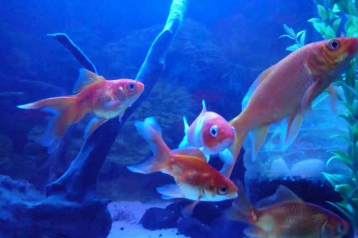
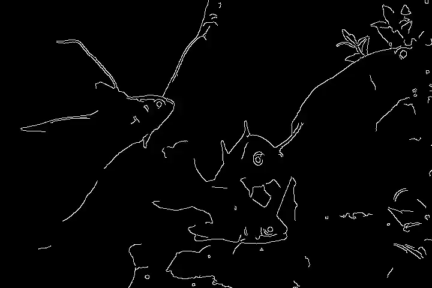
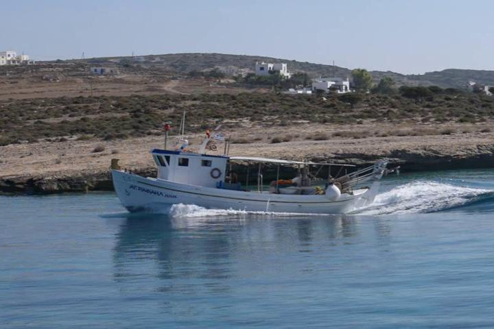
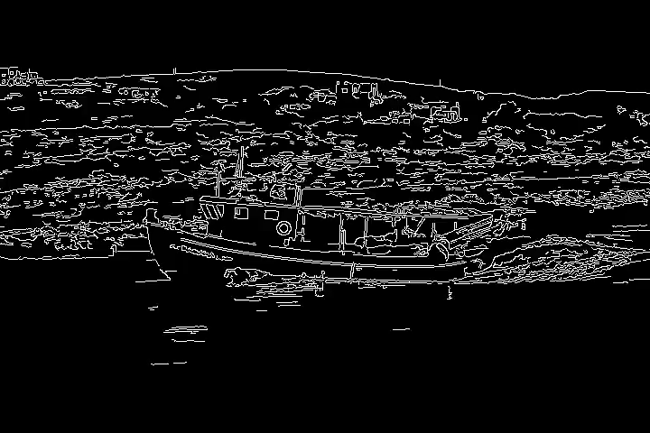
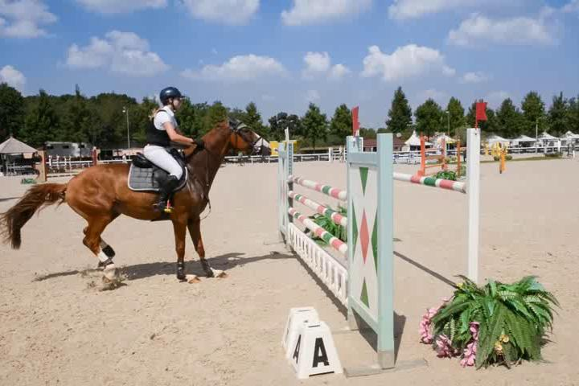
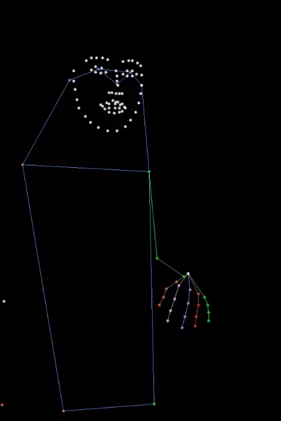
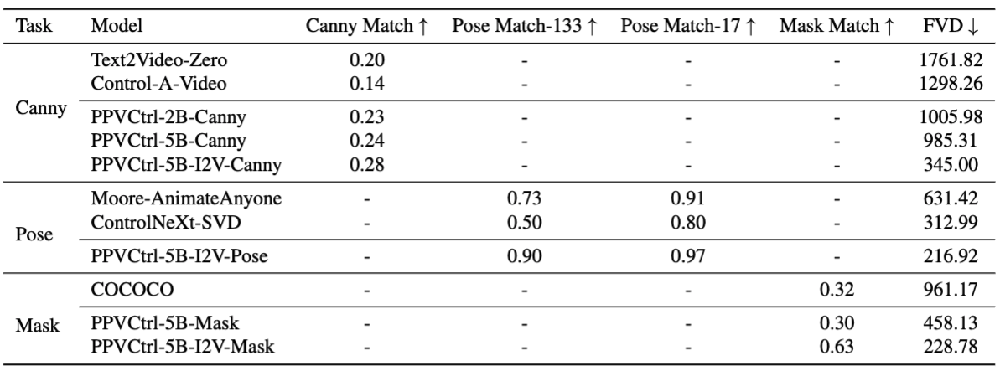
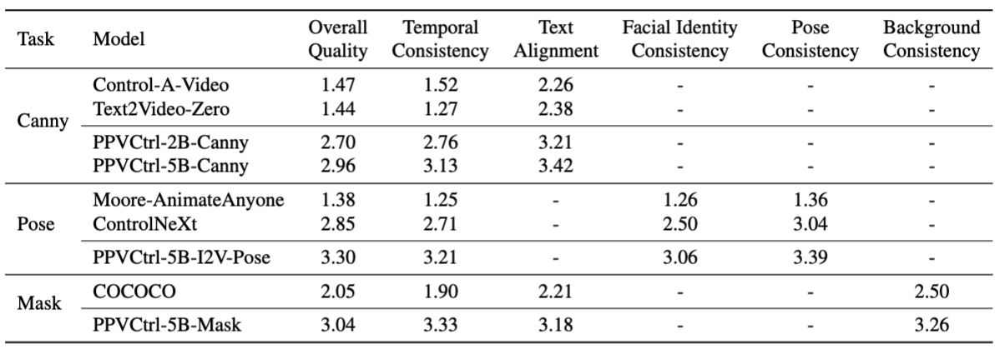

# PP-Vctrl: Controlable Video Generation Models
这个仓库是基于PP-Vctrl的官方实现。

PP-Vctrl 是一个基于**PaddlePaddle**的开源视频生成模型，旨在通过控制视频内容来实现高质量的视频编辑和生成。

PP-VCtrl 在 Canny2Video、Pose2Video 和 Mask2Video 三个任务的模型的控制精度和视频质量评估中，表现出色，媲美甚至超越现有的针对特定任务设计的方法。

**[PP-Vctrl: Controlable Video Generation Models](https://arxiv.org/absadada/)** 
</br>
<!-- [](https://arxiv.org/abs/) -->
[](https://https://github.com/PaddlePaddle/PaddleMIX.github.io/)
<!-- [](https://huggingface.co/spaces/) -->

***注意:*** 
## 📰 新闻
 `[2025-01-08]`:🔥模型推理代码，推理脚本，模型权重，已经发布。训练代码敬请期待！
## 🚩 **TODO/最新进展**
- [x] Vctrl v1
- [x] Inference code


## 📷 快速展示
### 1. 通过Canny边缘控制的PP-Vctrl视频生成：
<table class="center">
    <thead>
        <tr>
            <th>Text</th> <!-- 新增的列标题，在最左边 -->
            <th>Reference</th>
            <th>Control Videos</th>
            <th>Ours T2V</th>
            <th>Ours I2V</th>
        </tr>
    </thead>
    <tbody>
        <tr>
            <td>Group of fishes swimming in aquarium.</td> <!-- 新增的文本描述，在最左边 -->
            <td></td>
            <td></td>
            <td></td>
            <td></td>
        </tr>
        <tr>
            <td>A boat with a flag on it is sailing on the sea.</td> <!-- 第二行的文本描述 -->
            <td></td>
            <td></td>
            <td></td>
            <td></td>
        </tr>
        <!-- 可以继续添加更多行 -->
    </tbody>
</table>


### 2. 通过蒙版控制的PP-Vctrl视频生成：
<table class="center">
    <thead>
        <tr>
            <th>Text</th> <!-- 新增的列标题，在最左边 -->
            <th>Reference</th>
            <th>Control Videos</th>
            <th>Ours T2V</th>
            <th>Ours I2V</th>
        </tr>
    </thead>
    <tbody>
        <tr>
            <td>A rider in a dark helmet and white breeches is atop a chestnut horse...</td> <!-- 新增的文本描述，在最左边 -->
            <td></td>
            <td></td>
            <td></td>
            <td></td>
        </tr>
        <tr>
            <td>A dark gray Mini Cooper is parked on a city street...</td> <!-- 第二行的文本描述 -->
            <td></td>
            <td></td>
            <td></td>
            <td></td>
        </tr>
        <!-- 可以继续添加更多行 -->
    </tbody>
</table>

### 3. 通过DW-Pose控制的PP-Vctrl视频生成：
<table class="center">
    <thead>
        <tr>
            <th>Reference1</th> <!-- 新增的列标题，在最左边 -->
            <th>Reference2</th>
            <th>Pose Videos</th>
            <th>Ours 1</th>
            <th>Ours 2</th>
        </tr>
    </thead>
    <tbody>
        <tr>
            <td></td> 
            <td></td>
            <td></td>
            <td></td>
            <td></td>
        </tr>
        <tr>
            <td></td> 
            <td></td>
            <td></td>
            <td></td>
            <td></td>
        </tr>
        <!-- 可以继续添加更多行 -->
    </tbody>
</table>
    


## 🚀 快速开始
***注意:*** 
PP-Vctrl模型是建立在 PaddlePaddle 和 ppdiffusers 上的。以下是使用和操作说明。

### 1. 设置仓库和环境
```bash
# 创建python环境
conda create -n PP-Vctrl python=3.10 -y
source $(conda info --base)/etc/profile.d/conda.sh
conda activate PP-Vctrl
```
```bash
# 安装3.0.0版本的paddlepaddle-gpu，当前我们选择了cuda11.8的版本，可以查看 https://www.paddlepaddle.org.cn/ 寻找自己适合的版本
python -m pip install paddlepaddle-gpu==3.0.0b2 -i https://www.paddlepaddle.org.cn/packages/stable/cu118/
# 安装paddlenlp
pip install paddlenlp==v3.0.0-beta2
```
```bash
# 克隆 PaddleMIX 仓库
git clone https://github.com/PaddlePaddle/PaddleMIX.git
```
```bash
# 安装ppdiffusers
cd PaddleMIX
pip install -e ppdiffusers
# 进入 vctrl目录
cd PaddleMIX/ppdiffusers/examples/vctrl
# 安装其他所需的依赖
pip install -r requirements.txt
```
### 2. 下载预训练权重
请按照如下方式下载权重：

#### 2.1 下载PP-Vctrl-canny模型权重
```bash
#创建vctrl-canny模型权重目录
mkdir -p weights/canny

#下载i2v模型权重
wget -P weights/canny https://bj.bcebos.com/v1/dataset/PaddleMIX/vctrl/paddle_weights/vctrl_canny_5b_i2v_vctrl-tiny.pdparams

#下载t2v模型权重
wget -P weights/canny https://bj.bcebos.com/v1/dataset/PaddleMIX/vctrl/paddle_weights/vctrl_canny_5b_t2v.pdparams

```
#### 2.2 下载PP-Vctrl-msak模型权重
```bash
#创建vctrl-mask模型权重目录
mkdir -p weights/mask

#下载i2v模型权重
wget -P weights/mask https://bj.bcebos.com/v1/dataset/PaddleMIX/vctrl/paddle_weights/vctrl_5b_i2v_mask.pdparams

#下载t2v模型权重
wget -P weights/mask https://bj.bcebos.com/v1/dataset/PaddleMIX/vctrl/paddle_weights/vctrl_5b_t2v_mask.pdparams


```
#### 2.3 下载PP-Vctrl-pose模型权重
```bash
#创建vctrl-poses模型权重目录
mkdir -p weights/poses

#下载i2v模型权重
wget -P weights/poses https://bj.bcebos.com/v1/dataset/PaddleMIX/vctrl/paddle_weights/vctrl_pose_5b_i2v.pdparams
```

### 3. 准备预测试数据
所有测试数据按照以下规则放置，我们已经为你提供了所需的测试案例：
```
inference/
├── pose/case-1
│   ├── guide_values.mp4
│   ├── prompt.txt
│   └── reference_image.jpg
├── mask/case-1
│   ├── guide_values.mp4
|   ├── mask_values.mp4
│   ├── prompt.txt
│   └── reference_image.jpg
├── canny/case-1
│   ├── guide_values.mp4
│   ├── prompt.txt
│   └── reference_image.jpg
```


## 🔥 模型推理和视频生成
模型的最终推理结果可以在 **./infer_outputs** 中找到。
#### 3.1 通过Canny边缘控制生成视频
```bash
##t2v
sh scripts/infer_cogvideox_i2v_vctrl.sh

##i2v
sh scripts/infer_cogvideox_t2v_vctrl.sh
```

#### 3.2 通过遮罩控制生成视频
```bash
##t2v
sh infer_cogvideox_t2v_mask_vctrl.sh

##i2v
sh infer_cogvideox_i2v_mask_vctrl.sh
```
***Note:*** 3.1 and 3.2 contain text-to-video and image-to-video.
#### 3.3 通过人物姿态图控制生成视频
```bash
##i2v
sh scripts/infer_cogvideox_i2v_pose_vctrl.sh
```
***注意:*** 人物姿态控制模型只适用于i2v模型。 
#### 3.3 Gradio 应用
我们还创建了一个 Gradio 应用，供您与我们的模型进行交互。
```
```


## 📚 技术细节

<details close>
<summary>技术扩展</summary>

### 4.1 PP-Vctrl
在当今数字创意领域，视频生成技术已成为内容创作和叙事表达的重要工具。近期文本到视频的扩散模型虽然实现了自然语言驱动的视频生成，但在控制生成内容的精细时空特征方面仍面临重大挑战。 比如，在在广告创意、影视后期制作、直播带货、虚拟人交互等应用场景下，仅依靠文本接口难以精确指定物体轮廓、人体姿态以及画面背景等视觉特征，这些都需要更精确的控制信号来引导生成过程。目前的创作者往往需要通过反复调整文本描述来接近预期效果，这种试错式的迭代不仅耗时低效，也难以完全满足视频生成中对精确控制的需求，亟需更有效的视频控制方案。

尽管ControlNet在可控图像生成领域取得了突破性进展，但视频生成领域仍缺乏类似的通用控制方案。当前可控视频生成的研究主要集中在开发特定任务的解决方案，如人物动画生成、视频修复和运动控制等。这些方法通常为每个具体任务设计专门的模块，导致技术体系碎片化，缺乏统一的理论框架。同时，它们在处理文本提示和参考帧等基础输入时往往受限于任务特定的设计，难以实现灵活的跨任务迁移。此外，现有的一些方法试图通过控制图像生成模型来生成视频，而不是直接控制视频生成模型，这在时序一致性和整体生成质量上都存在局限。

针对上述挑战，我们提出了PP-VCtrl - 一个统一的视频生成控制框架，它通过引入辅助条件编码器，实现了对各类控制信号的灵活接入和精确控制，同时保持了高效的计算性能。它可以高效地应用在各类视频生成场景，尤其是在人物动画、场景转换、视频编辑等需要精确控制的任务中


- **1**. **PP-Vctrl** 通过稀疏残差连接实现特征的高效控制传播，在保证计算效率的同时实现精确控制。
- **2**. **PP-Vctrl** 通过统一的控制信号编码流程将多种条件输入转换为标准化表征，并利用任务特定掩码提升适应性。
- **3**. **PP-Vctrl** 统一而灵活的设计使PPVCtrl成为了一个真正通用的视频生成控制解决方案，并可通过pipeline的方式应用在各类视频生成场景，如人物动画、场景转换、视频编辑等。


### 4.2 定量指标评测
在边缘控制视频生成（Canny）、人体姿态控制视频生成（Pose）以及蒙版控制视频生成（Mask）三个任务的定量评估中，PPVCtrl模型在控制能力和视频质量指标上均能够媲美或超越现有开源的特定任务方法。



我们进行了人工评估实验，邀请了多位评估者对不同方法生成的视频进行打分，评估维度包括视频整体质量、时序一致性等。结果显示，在所有评估维度上，PPVCtrl的评分均高于现有开源方法。


</details>
<!-- 
## More version
<details close>
<summary>Model Versions</summary>
</details>
-->
<!-- 
## Contact us
Users: [Users@example.com](Users@example.com)  
-->
<!-- 
 ## BibTex

```
@article{guo2023animatediff,
  title={AnimateDiff: Animate Your Personalized Text-to-Image Diffusion Models without Specific Tuning},
  author={Guo, Yuwei and Yang, Ceyuan and Rao, Anyi and Liang, Zhengyang and Wang, Yaohui and Qiao, Yu and Agrawala, Maneesh and Lin, Dahua and Dai, Bo},
  journal={International Conference on Learning Representations},
  year={2025}
}

```上面的代码打印了一条消息 -->